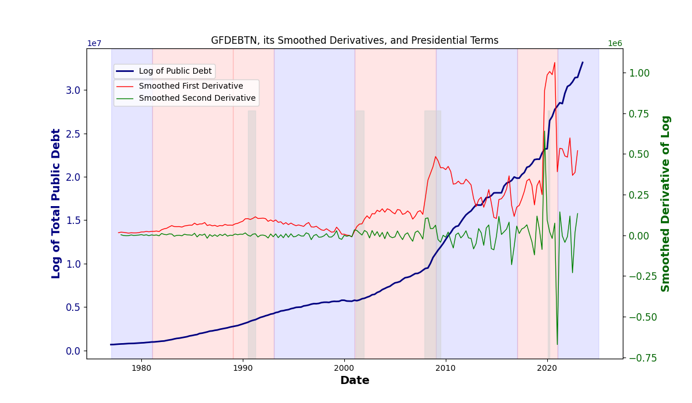

# Description

This python script is designed to analyze and visualize the relationship between U.S. public debt and presidential terms. It plots the log of total public debt (GFDEBTN) over time, highlighting presidential terms with distinct colors. The script also calculates and visualizes the first and second derivatives of the public debt, providing insights into how debt growth rates change over time. 

